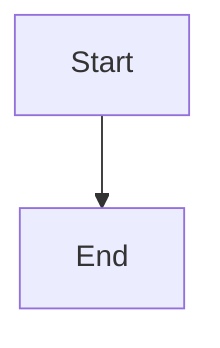
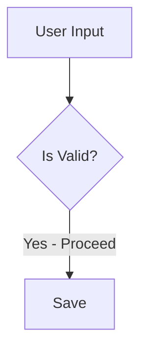
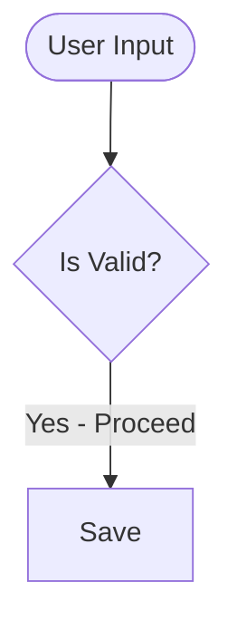
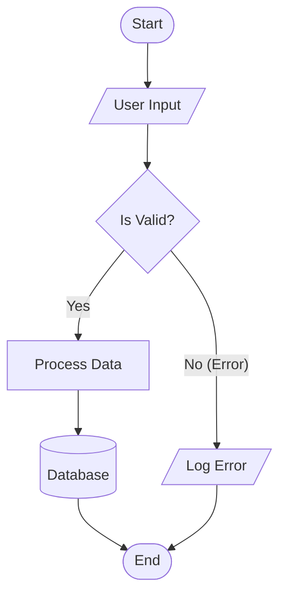
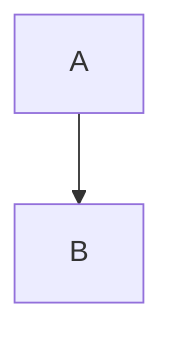

# 📊 Правила Mermaid диаграмм

Этот гайд описывает правила создания диаграмм Mermaid для обеспечения совместимости и читаемости.

## 1. Тип диаграммы

Для блок-схем (flowcharts) используйте **`graph TD`** вместо `flowchart TD`.
Это обеспечивает максимальную совместимость с различными рендерерами (IDE превью, GitHub, GitLab).



## 2. Текст и Метки (CRITICAL)

🔴 **ГЛАВНОЕ ПРАВИЛО:**
Если текст метки (на узле или на стрелке) содержит **пробелы**, **спецсимволы** (`?`, `!`, `&`, `(`, `)`) или кириллицу — **ОБЯЗАТЕЛЬНО берите его в кавычки**.

### ❌ Плохо (сломает рендеринг):


### ✅ Хорошо:


## 3. Формы узлов

Используйте разные формы для семантического значения:

| Синтаксис | Форма | Значение |
| :--- | :--- | :--- |
| `[Text]` | Прямоугольник | Действие / Процесс |
| `([Text])` | Скругленный | Старт / Стоп / Терминатор |
| `{Text}` | Ромб | Решение / Условие |
| `[[Text]]` | Подпрограмма | Ссылка на другой процесс |
| `[(Text)]` | Цилиндр | База данных / Хранилище |

## 4. Направление стрелок

- `TD` (Top-Down): Сверху вниз (стандарт для процессов).
- `LR` (Left-Right): Слева направо (для таймлайнов или широких схем).

## 5. Комментарии

Избегайте комментариев внутри блока `mermaid` (`%% comment`), если это не жизненно необходимо. Некоторые простые парсеры могут их не понимать. Если используете — ставьте на отдельной строке.

## 6. Пример "Идеальной" диаграммы



## 7. Встраивание в Markdown

Всегда оборачивайте в блок кода с указанием языка `mermaid`:

````markdown

````
